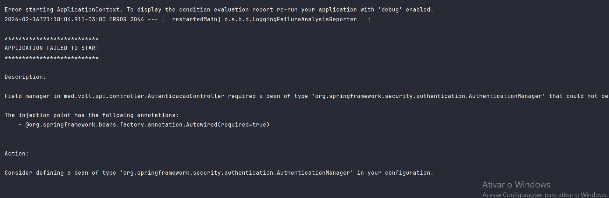
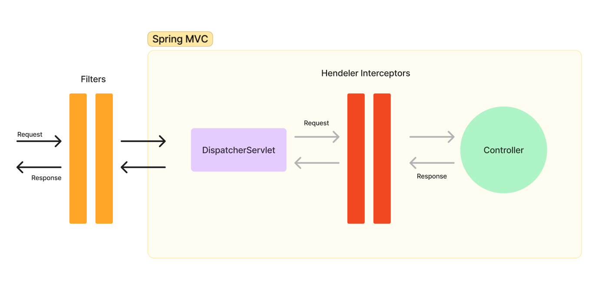

## Links das documentações de referências

+ [Record Classes:](https://docs.oracle.com/en/java/javase/16/language/records.html#GUID-6699E26F-4A9B-4393-A08B-1E47D4B2D263)
+ [Bean validation:](https://jakarta.ee/specifications/bean-validation/3.0/jakarta-bean-validation-spec-3.0.html#builtinconstraints)
+ [Status HTTP:](https://http.dog/)
+ [Documentação aplications.properties:](https://docs.spring.io/spring-boot/docs/current/reference/html/application-properties.html#appendix.application-properties.data)
+ [JPA Query Methods:](https://docs.spring.io/spring-data/jpa/reference/jpa/query-methods.html)
+ [Site JWT:](https://jwt.io/libraries?language=Java)

## Configurando o Dev Tools

Para fazer a configuração do Dev Tools, basta

1. pressionar a tecla sheft + sheft
2. settings
3. build, execution, Deployment
4. Compiler => marque a opção: Allows auto-make to start even if development
5. advanced settings
6. aply

## entendendo sobre configurações de controllers

Para se criar uma classe controladora no java é preciso usar a anotação ``@RestController`` e em seus métodos o tipo de
verbo HTTP que será invocado como no exemplo logo abaixo:

````
@RestController
@RequestMapping("medicos")
public class MedicoController {
    @PostMapping
    public void cadastrar(@RequestBody String cep){
        System.out.println(cep);

    }
}

````

## O que seria o padrão DTO?

O padrão DTO (Data Transfer Object) é utilizado para representar os dados que chegam em uma API e os dados que são
devolvidos por ela. Ele permite encapsular os dados em um objeto simples, facilitando a transferência de informações
entre diferentes camadas da aplicação.

## O que é o @Embeddable?

é uma anotação **usada para marcar uma classe como uma classe que pode ser incorporada em outra classe de entidade.** Em
outras palavras, ela é usada para definir uma classe cujos objetos podem ser incluídos como parte da representação de
uma entidade JPA.

Por exemplo, se você tem uma classe Endereco que deseja incluir como parte de uma entidade Usuario, você pode marcar a
classe Endereco com @Embeddable. Isso permite que você inclua todos os atributos da classe Endereco diretamente na
tabela de banco de dados associada à entidade Usuario, em vez de criar uma tabela separada para armazenar os detalhes de
endereço.

Ao marcar uma classe com @Embeddable, você pode usá-la como tipo de atributo em uma classe de entidade, usando a
anotação @Embedded. Essa anotação indica ao provedor JPA que os atributos da classe @Embeddable devem ser incluídos na
tabela da entidade que a contém.

## Conhecendo sobre o

O Lombok é uma biblioteca Java que visa reduzir a verbosidade do código, automatizando a geração de código repetitivo,
como getters, setters, construtores, métodos toString(), entre outros. Ele funciona através de anotações que são
processadas durante a compilação pelo Lombok Annotation Processor, gerando automaticamente o código correspondente.

Com o Lombok, desenvolvedores podem escrever código mais conciso e legível, focando nas funcionalidades do software em
vez de se preocuparem com a implementação tediosa de métodos repetitivos. Isso ajuda a reduzir erros e acelera o
desenvolvimento de software.

## Ferramentas de migrações com o Flyway

O Flyway é uma ferramenta de controle de versão de banco de dados. Ele permite que você gerencie e aplique migrações de
banco de dados de forma automatizada, garantindo que as alterações no esquema do banco de dados sejam aplicadas
corretamente. No contexto da aula, o Flyway foi utilizado para executar a migration e criar a tabela "usuarios" no banco
de dados.

**Importtante!!**

- Sempre que mexermos em arquivos de migrações é importante parar a execução do springbot
- Uma migration depois de executada nunca deve ser alterada

+ Padrão de versionamento: ``V1__create-table-medicos.sql``

## Validação com Bean Validation

Para se validar os campos recebidos por requisições basta usar a anotações como ``@Notnull``, ``@Noteblank``

**Importtante!!**

Para que o spring entenda que é preciso validar os campos é importante adicionar a anotação ``@valid`` antes do
parâmetro
<br>


## Sobre o @Transactional

O @Transactional é uma anotação utilizada em frameworks de persistência de dados, como o Spring
Framework, para definir transações em métodos ou classes. Transações são utilizadas para garantir a consistência dos
dados em operações que envolvem múltiplas alterações no banco de dados, assegurando que todas essas operações sejam
concluídas com sucesso ou revertidas em caso de erro.

Quando você marca um método com @Transactional, o framework cuida da criação e gerenciamento da transação para você,
iniciando uma nova transação antes da execução do método marcado e a finalizando ao término do método. Se ocorrer uma
exceção durante a execução do método, a transação é revertida (rollback) para garantir a integridade dos dados.

## Problemas com arquivos de migrações

As vezes pode ocorrer de mexermos em migrações com o devTools em execução, isso pode acasionar um erro, pois ele pode
reiniciar a aplicação com o arquivo de migração imcompleto, fazendo os arquivos se perderem em instruções de criação das
tabelas. Caso isso ocorra o erro seria esse:

````
Exception encountered during context initialization - cancelling refresh attempt: org.springframework.beans.factory.BeanCreationException: Error creating bean with name 'flywayInitializer' defined in class path resource [org/springframework/boot/autoconfigure/flyway/FlywayAutoConfiguration$FlywayConfiguration.class]: Validate failed: Migrations have failed validation
````

*Para resolver esse problema será necessário acessar o banco de dados da aplicação e executar o seguinte comando sql:*

* *delete from flyway_schema_history where success = 0;*
* *drop database vollmed_api;*
* *create database vollmed_api;*

## Paginação e ordenação de dados

## DTO

O padrão DTO (Data Transfer Object) é um padrão de arquitetura que era bastante utilizado antigamente em aplicações Java
distribuídas (arquitetura cliente/servidor) para representar os dados que eram enviados e recebidos entre as aplicações
cliente e servidor.

O padrão DTO pode (e deve) ser utilizado quando não queremos expor todos os atributos de alguma entidade do nosso
projeto, situação igual a dos salários dos funcionários mostrado no exemplo de código anterior. Além disso, com a
flexibilidade e a opção de filtrar quais dados serão transmitidos, podemos poupar tempo de processamento.

## Erro de se usar uma entidade JPA diretamente em um método do controlador

Outro problema muito recorrente ao se trabalhar diretamente com entidades JPA acontece quando uma entidade possui algum
autorrelacionamento ou relacionamento bidirecional. causando o error ``StackOverflowError``

## Implementando o recurso de paginação

Para implementar o recurso de paginação em uma API Rest utilizando o Spring Framework, você pode seguir os seguintes
passos:

- Importe corretamente a classe Pageable no seu controlador.
- No método que irá listar os registros, adicione o parâmetro Pageable.
- Altere o tipo de retorno do método para Page<T>, onde T é o tipo dos registros que você está listando.
- Utilize o parâmetro Pageable no método de busca dos registros, passando-o como argumento.
- Na URL da requisição, utilize os parâmetros size e page para controlar o número de registros exibidos e a página a ser
  exibida, respectivamente.
- Dessa forma, você estará configurando a requisição para trazer apenas a quantidade desejada de registros por página

## Ordenação pela URL no front

Para se ordenar a busca por registro pela url basta usar o recurso ?sort=[nomeDoAtriuto] como no exemplo abaixo:

+ http://localhost:8080/medicos?sort=nome

## Parâmetros de paginação

por padrão, os parâmetros utilizados para realizar a paginação e a ordenação devem se chamar page, size e sort.
Entretanto, o Spring Boot permite que os nomes de tais parâmetros sejam modificados via configuração no arquivo
application.properties.

Por exemplo, poderíamos traduzir para português os nomes desses parâmetros com as seguintes propriedades:

````
spring.data.web.pageable.page-parameter=pagina
spring.data.web.pageable.size-parameter=tamanho
spring.data.web.sort.sort-parameter=ordem

````

## PUT ou PATCH?

Escolher entre o método HTTP PUT ou PATCH é uma dúvida comum que surge quando estamos desenvolvendo APIs e precisamos
criar um endpoint para atualização de recursos. Vamos entender as diferenças entre as duas opções e quando utilizar cada
uma.

**PUT**

O método PUT substitui todos os atuais dados de um recurso pelos dados passados na requisição, ou seja, estamos falando
de uma atualização integral. Então, com ele, fazemos a atualização total de um recurso em apenas uma requisição.

**PATCH**

O método PATCH, por sua vez, aplica modificações parciais em um recurso. Logo, é possível modificar apenas uma parte de
um recurso. Com o PATCH, então, realizamos atualizações parciais, o que torna as opções de atualização mais flexíveis.

**Qual escolher?**

Na prática, é difícil saber qual método utilizar, pois nem sempre saberemos se um recurso será atualizado parcialmente
ou totalmente em uma requisição - a não ser que realizemos uma verificação quanto a isso, algo que não é recomendado.

## Padronização dos retornos de uma API

É muito importante tratar o retorno das requisições HTTP com os seu devidos status dos verbos HTTP (delete, post, get,
put). Para isso o spring possui uma classe chamada ResponseEntity que controla as respostas devolvidas pelo Spring Boot

para exemplificar temos a classe de controller de Médicos:

````
@DeleteMapping("/{id}")//parâmetro dinâmico que vem da URL
    @Transactional
    public ResponseEntity excluir(@PathVariable Long id){
        var medico = repository.getReferenceById(id);
        medico.excluir();

        return ResponseEntity.noContent().build();

    }
 ````

**Método de cadastrar, POST.**

esse metodo precisa devolver uma série de informações como:

+ _Devolver o código 201_
+ _Cabeçalho location com a URI_
+ _No corpo da resposta é necessário ter uma representação do recurso recém criado._

## Tratamento de error em uma api

É de muita importância ao se construir uma API fazermos o tratamento de erro. Nesse caso um dos primeiros tratamentos
que utilizamos foi a ocultação da stacktrace logo apois um erro como o 500 por exemplo e para tal feito foi preciso
mexer no arquico ``application.propertis`` e adicionarmos a seguinte instrução:

+ server.error.include-stacktrace=never --> com isso a stactrace não aparecerá como resposta ao usuário

## @RestControllerAdvices

Por padrão, exceções não tratadas no código são interpretadas como erro 500. Para lidar com esse problema,
isolamos o tratamento de erros em uma classe separada, utilizando a anotação @RestControllerAdvice. Criamos a classe
TratadorDeErros, com um método tratarErro404() que trata a exceção EntityNotFoundException e retorna o código de erro

404. Essa abordagem permite ter um código mais enxuto nos controllers e facilita o tratamento de diferentes tipos de
     erros e sem utilizar o try/catch nos controladores de rotas.

## Spring security

## hashing de senha

Ao implementar uma funcionalidade de autenticação em uma aplicação, independente da linguagem de programação utilizada,
você terá que lidar com os dados de login e senha dos usuários, sendo que eles precisarão ser armazenados em algum
local, como, por exemplo, um banco de dados.

Senhas são informações sensíveis e não devem ser armazenadas em texto aberto, pois se uma pessoa mal intencionada
conseguir obter acesso ao banco de dados, ela conseguirá ter acesso às senhas de todos os usuários. Para evitar esse
problema, você deve sempre utilizar algum algoritmo de hashing nas senhas antes de armazená-las no banco de dados.

Existem diversos algoritmos de hashing que podem ser utilizados para fazer essa transformação nas senhas dos usuários,
sendo que alguns são mais antigos e não mais considerados seguros hoje em dia, como o MD5 e o SHA1. Os principais
algoritmos recomendados atualmente são:

1. Bcrypt
2. Scrypt
3. Argon2
4. PBKDF2

## Configurações de segurança

É preciso tornar a autenticação stateless e para isso devemos utilizamos a classe``SecurityConfigurations`` no pacote
infra.security para personalizar as configurações de segurança. devemos Desabilitar a proteção contra ataques CSRF e
definir a política de criação de sessão como STATELESS. Com essa configuração, o Spring Security não bloqueia mais todas
as requisições e não exibe o formulário de login, permitindo que as requisições sejam liberadas e retornem os dados
corretos.

## Error no controle de autenticação

Para se resolver esse erro basta implementar o método AuthenticationManager:

````java

@Bean// ensina como o spring injeta as dependências
public AuthenticationManager authenticationManager(AuthenticationConfiguration configuration) throws Exception {
    return configuration.getAuthenticationManager();
}
````



## Configuração do tipo de criptografia na API

Para que podemos ensinar para o Spring qual algoritimo de hash usar, basta adicionar o método ``passwordEncoder`` na
classe de configuração

````java

@Bean
public PasswordEncoder passwordEncoder() {
    return new BCryptPasswordEncoder();
}
````

## A interface UserDetails

A interface UserDetails é uma interface do Spring Security que define os métodos necessários para obter informações
sobre um usuário autenticado. Ela fornece informações como nome de usuário, senha, autorizações (roles) e se a conta do
usuário está expirada, bloqueada, etc. Essas informações são usadas pelo Spring Security para realizar a autenticação e
autorização do usuário.

## Processo de interceptação de requisições (middleware)

O filtro de segurança em um projeto Spring Boot serve para interceptar requisições e validar
um token antes que ele chegue ao controller. Para isso criamos a classe SecurityFilter e implementamos a interface
Filter.
Logo a baixo vomos verificar a construção dessa classe:

````java

@Component// usado para anotar classes genéricas
public class SecurityFilter extends OncePerRequestFilter {
    @Override
    protected void doFilterInternal(HttpServletRequest request, HttpServletResponse response, FilterChain filterChain) throws ServletException, IOException {
        filterChain.doFilter(request, response);// chama o próximo filtro
        System.out.println("Filtro chamado");
    }
}
````

**Note** que a classe SecurityFilter possui uma anotação chamada de _@Component_ essa anotação é usada no Spring
Framework para indicar que uma classe é um componente gerenciado pelo contêiner de injeção de dependência. Essa anotação
permite que o Spring detecte automaticamente a classe e a registre como um bean, tornando-a disponível para ser injetada
em outras partes do sistema. Em resumo, a anotação @Component é usada para definir uma classe como um componente do
Spring.

<br>



## Configuração da ordem dos filtros do spring

A função de filtro no Spring Framework é usada para interceptar e manipular requisições HTTP e respostas antes e depois
de serem processadas pelos controladores. Isso permite a execução de lógica adicional, como autenticação, autorização,
validação de entrada, logging e muito mais. Os filtros são implementados como classes que implementam a interface
javax.servlet.Filter. Eles são configurados no arquivo de configuração do Spring (web.xml ou usando anotações) e podem
ser ordenados para especificar a ordem de execução.

## Tipos de erros que são comuns de acontecer ao adicionar a classe de segurança no spring

1. **Erro ao recuperar o token JWT**

Na linha do return, dentro do if, utilizamos o método replace da classe String do Java para apagar a palavra Bearer.
Repare que existe um espaço em branco após a palavra Bearer. Um erro comum é esquecer de colocar esse espaço em branco e
o certo é deixar o código assim:

````java
private String recuperarToken(HttpServletRequest request) {
    var authorizationHeader = request.getHeader("Authorization");
    if (authorizationHeader != null) {
        return authorizationHeader.replace("Bearer ", "").trim();
    }

    return null;
}
````